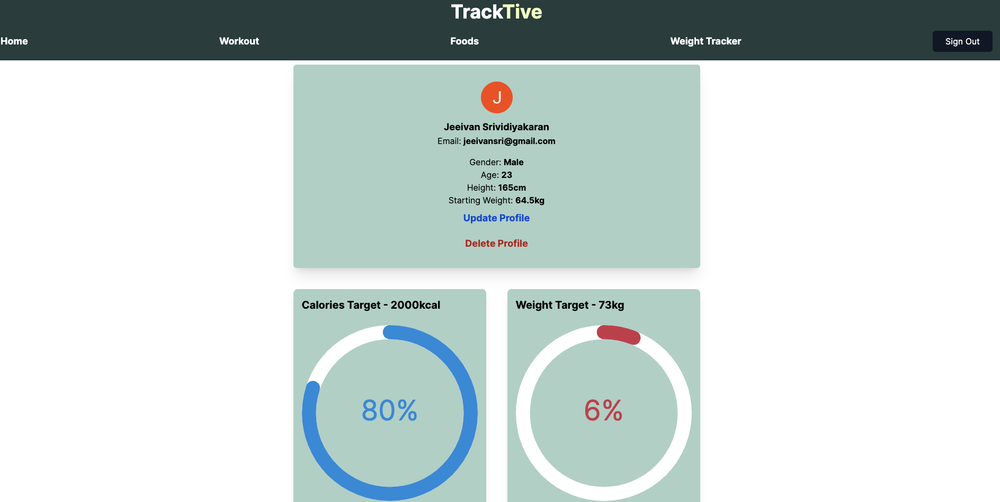
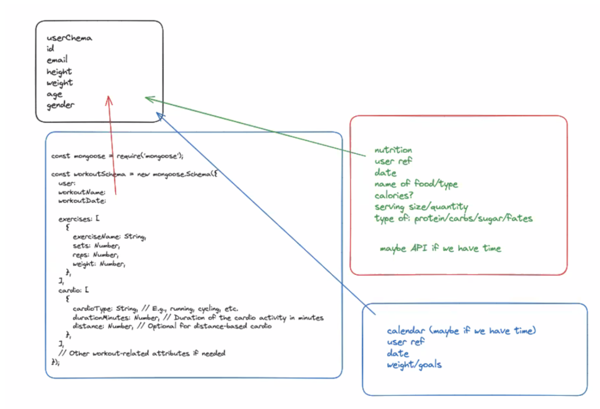
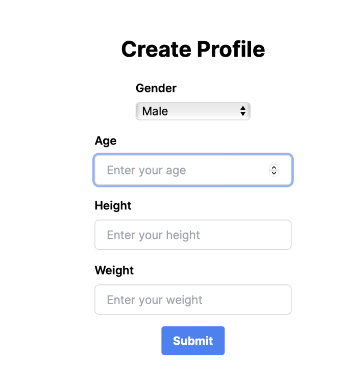
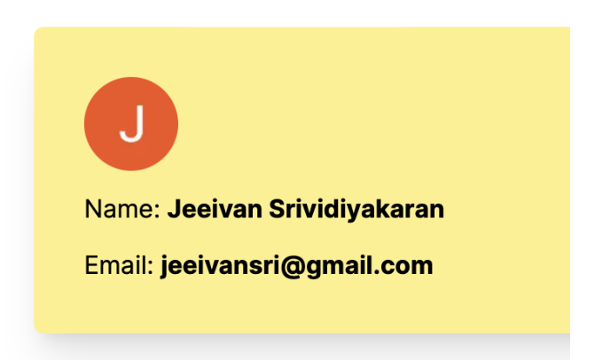

# SEI Unit 3 Project ReadMe

## Project Description

After 2 weeks of learning React at the General Assembly Software Engineering Immersive Course we were given our first group project to make a website with a MERN stack. The aim of our project was to create a website that allows a user to store and track their workouts and foods they have eaten as well as being able to set goals for their workout and calories they intake- primarily aimed at people who go to the gym/keeping healthy.

## Table of Contents

- [Deployment Link](#deployment-link)
- [Timeframe & Working Team](#timeframe-and-working-team)
- [Technologies Used](#technologies-used)
- [Brief](#brief)
- [Planning](#planning)
- [Build Process](#build-process)
- [Challenges](#challenges)
- [Wins](#wins)
- [Key Learnings/Takeaways](#key-learningstakeaways)
- [Bugs](#bugs)
- [Future Improvements](#future-improvements)

## Deployment Link

Unfotunately having issues with deployment at this time.

## Timeframe and Working Team

We did this project as part of a group of me that included Adriana Iaffa, Matt Burton-Johnson and myself. We were given 4 days to work on the project and the 5th and final day to deploy the project and present it to our peers.

Github Links-
(https://github.com/AdrianaIaffa) 
(https://github.com/MBurton-Johnson) 

## Technologies Used

Tailwind CSS
HTML
Vanilla Javascript ES6
MongoDB
Mongoose
Node.js
Vue.js
Express
React
Next.js 13

## Brief

- A working full-stack, single-page application hosted on Heroku.
- Incorporate the technologies of the MERN-stack:
MongoDB/Mongoose
Express
React
Node
- Have a well-styled interactive front-end.
- Communicate with the Express backend via AJAX.
- Implement token-based authentication, including user sign-up, log in, and log out functionality.
- Implement authorization by restricting CUD (Create, Update, Delete) data functionality to authenticated users. Navigation should dynamically respond to the login status of the user.
- Have a well-scoped feature set. Full-CRUD data operations are not mandatory if other features are included, such as:
Consuming data from a third-party API.
Implementing additional functionality for admin users.
Incorporating a highly dynamic UI or data visualization.
Other complexity/features approved by the instructor.

## Planning

**Pages:**
Login/Sign-up Page:
Create a profile and log in using GoogleAuth.

Home Page:
Navigation Bar
Goals Tracker (stretch goal)
Display completed workouts for the week
Display foods eaten

Workout Page:
Input and log workouts
Display workouts in a table
Include an "Insert Workout" button with a modal for easy data entry
Allow users to choose between resistance training and cardio exercises, with a different input display based on the selection

Nutrition Page:
Input and log food consumption
Display a list of foods eaten
Include an "Insert Food" button with a modal for easy data entry

**Work Split:**
Jeeivan: Landing Page, GoogleAuth, Profile Creator
Adriana: Workout Page
Matt: Nutrition Page
We decided to split the work as above as Adriana was very keen and had a good visual idea on how she wanted the workout page to be displayed. I chose to do the landing page as I was confident in my ability to handle the google login as well as rendering the landing page.

**Login Page:**
Serve as the landing page
Integrate GoogleAuth for login
If it's the user's first login, direct them to the profile creation page
For returning users, redirect them to the home page

**Profile Creator:**
Allow users to input height, gender, age, and weight

**Home Page:**
Feature a navigation bar
Serve as a dashboard displaying users' workout history
Include a progress bar for calories and weight goals

**Workout Page:**
Display workouts in a table
Include an "Insert Workout" button triggering a modal for convenient data input
Allow users to choose between resistance training and cardio exercises, with dynamic input displays based on the selection

**Nutrition Page:**
Display a list of foods eaten
Include an "Insert Food" button triggering a modal for convenient data input

**Stretch Goals:**
Create an individual profile page for users, allowing them to edit their information
Develop a schema for a calendar, incorporating goals for tracking weight and potentially calories
Implement a progress bar for calories and weight goals on the homepage
Utilize an API for foods to enable users to input food and quantity, fetching calories and macros

**MongoDB:**
Our database plan is straightforward, with each entity (nutrition, workout, calendar) referencing user IDs to ensure each user has personalized data for each entity.

## Build Process

**Day 1**

I initiated the project by developing the backend endpoints and schema for the user section, a responsibility I willingly undertook. This phase proved relatively straightforward, drawing on my experience from crafting the backend in my previous MEVN project. It primarily involved some refactoring and integration of similar components.

The most challenging aspect of the day centred around establishing a connection between Google Authentication and the frontend. Although initially daunting, I navigated through this hurdle with the aid of YouTube tutorials and independent research, eventually achieving a functional integration.

Following that, I designed a straightforward page enabling users to enrich their profiles by providing additional information. Satisfied with its appearance, my focus shifted to the upcoming day's tasks, which involved establishing a connection between this page and the backend. Additionally, I worked on incorporating the user ID into the endpoint of the page.

I successfully managed to display the information retrieved from the login on this page, enhancing the user experience. However, a notable challenge emerged as we navigated the process of pushing to Git and merging individual branches into the main repository. This marked our first experience with group projects, presenting unforeseen difficulties. Despite initial hurdles, persistent trial and error, along with thorough research, enabled us to achieve our first commits for both frontend and backend projects. Merging these into the main branch at the end of the working day was a significant accomplishment, and I felt particularly pleased considering the initial complexities of the task.

**Day 2**

- On this day I was having issues with being able to get the id of the user from mongoDB and fetch it from the front end
- I was able to solve this by using the session that gave me the user email and then changing my back end to get a user by using the email, as shown below, rather than the id, which I was having a lot of trouble accessing through the database

[Insert Screenshot]

- I was then struggling with how I could get this userData to be used in the NavBar but after some thinking I decided to take the same approach in the NavBar too and this allowed me to get the userData and this then allowed me to put the id of the user into the endpoints for each of the different pages
- This would then allow my colleagues to also use the id in their workout/food page by using the id from the URL that I added
- I also added the data from Mongo onto the home page to display the profile of the user
- I also added some styling and added more to the landing page to make it clear to anyone who visits the website for the first time what the website is about along with adding a google button that was imported through react to make it clear the login is only through google

[Insert Screenshot]

- I have been pleased with how my group have been working as a team and we make sure to start the day with a plan of what we are each going to do and then meet back once before lunch to discuss what we had done and git merge and do the same thing in the afternoon too

**Day 3**

- I am pleased with the progress I made today as I have now the full CRUD functionality with my user and their profile
- Getting the CRUD finished was fairly straightforward as I had already got the back end working for these from the first day and checked these with postman and so this meant I only needed to implement the endpoints from the backend into the front end
- I also now created a new schema for calendar that is going to allow the user to input their weights along with the current date and allow them to track their progress towards their goal weight which I added to the userSchema

[Insert Screenshot]

- We decided as a group that we wanted the user to be able to track their progress towards their goal weight through the home screen so my next task for the day was to be able to grab all the information I needed onto the home page
- Now that I had this information I just needed to add the progress bar with styling and some mathematics to work out the percentage of the progress as shown below
- Working as a team has continued to go smoothly as we continue to keep each other up to date and when we have any blockers we make sure to come together to discuss and help each other out
- 
[Insert Screenshot]

**Day 4**

Towards the final phase of the project, I implemented a design change to the progress bar, transforming it into a circle. This adjustment, in my view, enhanced the user-friendliness of the website.
As a group, we diligently adhered to a routine of merging our files at least twice a day, finding this approach highly effective in keeping everyone in sync with the ongoing developments.

[Insert Screenshot]

Collectively, we are immensely pleased with the progression of our project. Recognizing the limited time remaining for the week, we made a strategic decision to leave the functionality as it is and shift our focus to the styling aspect. This collaborative effort ensures that we conclude the project on a high note, with a polished and visually appealing end result as shown.

## Challenges

- One blocker I was having is that despite the user being signed out it is continuing to show their data underneath the about section
- I was able to fix this by adding a conditional statement so that the data would only render if the userData was present which it would not be once the user is signed out
[Insert Screenshot]
- I was having an issue where I wanted to make a progress bar for the total calories eaten that day compared to the calories goal for the day
- I was trying to solve this using context to access the data from the food page however after a lot of difficulty using the context method I used a different approach where I created a new endpoint that would call all the food data submitted by the individual user for that day and sum the total calories from this as shown
- I then called this fetch in my home page to grab the total calories for the user that is signed in and am pleased to get this working
[Insert Screenshot]

## Wins

I was happy with how I adjusted the progress bar to change colour depending on the percentage of the progress to make it more clear for the user on how their progress is coming along. I was able to implement this with the following code below.

[Insert Screenshot]

## Key Learnings/Takeaways

- The importance of having stand ups and stand downs within the group to make sure everyone is on the same page
- Importance of merging at least twice a day to avoid any conflicts and keep the main up to date
- React can be very useful and helpful for website development despite being tricky to implement at first

## Bugs

If the user completed their weight goal and tried to set a new weight goal this would cause an error with the tracker and keep it at 100% and to fix the user would need to delete their profile and create a new one with a new weight goal.

## Future Improvements

- If I had more time on the project I would have tried to figure out having the website have its own login system rather than using google Auth
- To include a goal for workout e.g. a goal weight for an exercise a user is working towards and have the website track the weights the user has been using for each exercise so they can see their progress in their strength
- To improve the styling as although I am pleased with how it looks we focused the majority on the functionality and only put very little time into the styling

